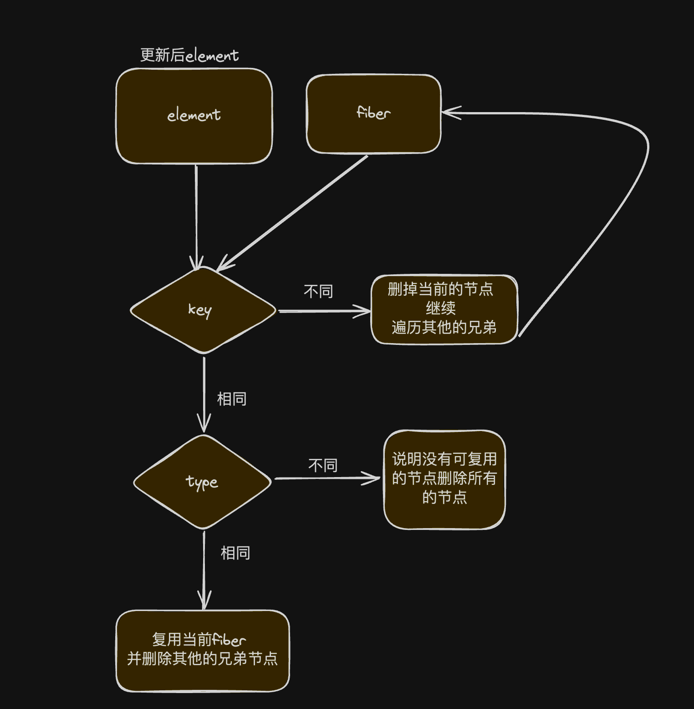

# my-react

# eslint

ESLint 是一个用于识别和报告 JavaScript 代码中发现的模式的静态代码分析工具。它旨在帮助开发者发现和修复代码中的问题，从而提高代码质量和可维护性。

### ESLint 的主要功能

1. 代码质量检查：ESLint 可以检测代码中的常见错误和不良实践，包括语法错误、代码风格问题和潜在的逻辑错误。
2. 代码风格一致性：通过配置规则，ESLint 可以确保团队中所有开发者遵循相同的编码风格，从而提高代码的一致性。
3. 自动修复：ESLint 提供了一些规则的自动修复功能，可以自动修复部分代码风格问题。
4. 插件和扩展：ESLint 支持插件系统，可以使用第三方插件来扩展其功能，支持更多的规则和自定义检查。
5. 集成性强：ESLint 可以与多种编辑器和集成开发环境（IDE）集成，提供实时的代码检查和反馈。

# prettier

代码格式化工具

### prettier 的主要功能

1. 自动格式化：Prettier 可以自动处理代码格式，使代码符合预设的风格规范。
2. 无争议的代码风格：Prettier 提供了一套固定的规则集，减少了团队中关于代码风格的争议和意见不合。
3. 支持多种语言：不仅支持 JavaScript 和 TypeScript，还支持 CSS、HTML、JSON、Markdown 等多种文件格式。
4. 集成方便：可以与各种编辑器（如 VSCode、Sublime Text）和跨各种开发工具（如 Git hooks、CI/CD）集成。
5. 一致性：通过 Prettier，可以确保团队中的每个开发者的代码风格一致，减轻代码审查的负担。

# eslint-config-prettier

当 ESLint 的规则和 Prettier 的规则相冲突时，就会发现一个尴尬的问题，用其中一种来格式化代码，另一种就会报错。

prettier 官方提供了一款工具 eslint-config-prettier 来解决这个问题。

本质上这个工具其实就是禁用掉了一些不必要的以及和 Prettier 相冲突的 ESLint 规则。

```JSON
  // 在 extends 部分加入 prettier 即可
{
  "extends": [
    "...",
    "prettier"
  ]
}

```

# eslint-plugin-prettier

这个插件的主要作用就是将 prettier 作为 ESLint 的规则来使用，相当于代码不符合 Prettier 的标准时，会报一个 ESLint 错误

```JavaScript
// 修改 eslintrc 文件

{
  "plugins": ["prettier"],
  "rules": {
    "prettier/prettier": "error"
  }
}
```

# 简化配置

经过上面两步配置后， ESLint 的配置文件大概如下：

```jsx
 {
  "extends": [
    "prettier"
  ],
  "plugins": ["prettier"],
  "rules": {
    "prettier/prettier": "error"
  }
}
```

其实可以简化一下，直接 extend 一下 plugin:prettier/recommended 即可。

如下：

```jsx
{
  "extends": ["plugin:prettier/recommended"]
}
```

# eslint

eslint 8 后实现的扁平化的配置

```javaScript
import pluginJs from "@eslint/js";
import eslintConfigPrettier from "eslint-config-prettier";
import prettier from "eslint-plugin-prettier";
import globals from "globals";
import tseslint from "typescript-eslint";

export default [
  { files: ["**/*.{js,mjs,cjs,ts}"] },
  { ignores: ["**/*.config.mjs"] },
  { languageOptions: { globals: globals.node } },
  pluginJs.configs.recommended,
  eslintConfigPrettier,
  ...tseslint.configs.recommended,
  {
    plugins: {
      prettier,
    },
    rules: {
      "prettier/prettier": [
        "error"
      ],
    }
  }
];
```

```
  生活中充满了无常, 无论我们做了多好的准备我们还是上不了山顶,我们就是要接受生活的无常,
```

# React Update

## UpdateQueue 的工作原理

1. 双缓冲结构：
   • UpdateQueue 实际上由两个队列组成：一个当前队列（current queue）和一个正在进行中的队列（work-in-progress queue）。
   • 当前队列表示屏幕的可见状态，而正在进行中的队列可以异步地被处理和修改，在提交前，它们是相互独立的。
   • 如果正在进行中的渲染被丢弃，我们会通过克隆当前队列来创建一个新的正在进行中的队列。
2. 共享的单链表结构：
   • 这两个队列共享一个持久的单链表结构。
   • 每个队列维护一个指向第一个未处理更新的指针。
   • 正在进行中的队列的指针总是等于或大于当前队列的指针，因为我们总是在处理正在进行中的队列。
   • 当前队列的指针只有在提交阶段才会更新。
3. 更新的附加：
   • 为了确保更新不会丢失，我们将更新附加到两个队列的末尾。
   • 这样保证了更新在下一个正在进行中的队列中也会被处理到。

## 优先级和更新处理

1.  更新优先级：
    • 更新不是按优先级排序的，而是按插入顺序排列，新的更新总是附加到列表的末尾。
    • 在渲染阶段处理更新队列时，只有具有足够优先级的更新才会被包含在结果中。
    • 如果由于优先级不足而跳过一个更新，该更新将保留在队列中，以便在较低优先级的渲染过程中处理。
2.  高优先级更新的重基：
    • 被跳过的更新之后的所有更新无论优先级如何都将保留在队列中，这意味着高优先级的更新有时会在两个不同的优先级阶段被处理两次。
    • 我们也会跟踪一个基状态，表示应用队列中第一个更新之前的状态。
3.  处理示例：
    • 假设基状态是 ''，更新队列如下：

            ```s
            A1 - B2 - C1 - D2;
            ```

            • 其中数字表示优先级，更新通过在之前状态后追加字母来应用。

            • 第一轮渲染，优先级 1：

            ```s
            基状态: ''
            更新: [A1, C1]
            结果状态: 'AC'
            ```
            •	第二轮渲染，优先级 2：
            ```
            基状态: 'A'            <- 基状态不包括 C1，因为 B2 被跳过。
            更新: [B2, C1, D2]   <- C1 被重基于 B2 之上。
            结果状态: 'ABCD'
            ```

## 总结

UpdateQueue 通过双缓冲结构和单链表的共享机制，确保了更新操作的顺序处理和不丢失。优先级机制允许在不同优先级下处理更新，最终状态是确定的，不受中间状态的影响。这种设计确保了 React 应用中状态更新的可靠性和一致性。

# React Fiber Tree

## FiberRootNode

在 React 的 Fiber 架构中，FiberRootNode 是一个关键的数据结构，它代表了整个 React 应用的根节点。FiberRootNode 负责管理应用的状态、调度更新和协调渲染。以下是对 FiberRootNode 的详细解释。

### FiberRootNode 的功能:

1. 状态管理：
   • FiberRootNode 管理整个 React 应用的状态，包括当前的 Fiber 树和待处理的更新。
2. 更新调度：
   • 负责调度应用的状态更新，确保高优先级的更新能够优先处理。
3. 协调渲染：
   • 协调和处理整个应用的渲染过程，从根节点开始遍历和更新 Fiber 树。

### FiberRootNode 的结构

FiberRootNode 是一个复杂的对象，它包含多个属性来管理和协调应用的状态和更新。以下是 FiberRootNode 的主要属性：

    •	containerInfo：保存根容器的信息（例如 DOM 元素）。
    •	current：指向当前 Fiber 树的根节点 (即 HostRootFiber).
    •	pendingChildren：指向待处理的子节点列表。
    •	finishedWork：指向已经完成工作的 Fiber 树。
    •	timeoutHandle：用于处理异步更新的定时器。
    •	context 和 pendingContext：用于管理上下文信息。
    •	callbackNode 和 callbackPriority：用于调度更新的回调函数和优先级。

## HostRootFiber

HostRootFiber 是 Fiber 树的根节点，它承担了 React 应用的初始挂载和后续更新的协调工作。其主要功能包括：

1. 初始化挂载：
   • 当 React 应用第一次渲染时，HostRootFiber 负责从根节点开始构建 Fiber 树，并将 React 组件渲染到 DOM 中。
2. 状态管理：
   • 管理 React 应用的全局状态，包括上下文和更新队列。
3. 更新调度：
   • 处理状态更新，并根据优先级调度这些更新，以确保高优先级的更新能及时响应。
4. 渲染协调：
   • 从根节点开始协调 Fiber 树的渲染过程，处理 DOM 的更新和重新渲染。

### HostRootFiber 的结构

HostRootFiber 作为一个 Fiber 节点，包含了一些特定的属性来管理和协调应用的状态和更新。以下是 HostRootFiber 的一些关键属性：

• tag：标识 Fiber 节点的类型，对于 HostRootFiber，其值是 HostRoot。
• stateNode：指向与此 Fiber 节点关联的具体实例，对于 HostRootFiber，它指向 FiberRootNode。
• updateQueue：保存需要处理的更新。
• memoizedState：存储已计算的状态。
• pendingProps 和 memoizedProps：分别存储新的和已计算的属性。

### FiberRootNode 和 HostRootFiber 的关系

1. FiberRootNode 是整个 React 应用的根节点，用于管理应用的状态、调度更新和协调渲染。
2. HostRootFiber 是 Fiber 树的根节点，它挂载在 FiberRootNode 上，并通过 FiberRootNode 的 current 属性指向。
   

### 创建与初始化

在调用 ReactDOM.render 时，React 会创建 FiberRootNode 和 HostRootFiber，并初始化它们的关系。以下是一个简化的过程描述：

1. 创建 FiberRootNode：
   • 当 ReactDOM.render 被调用时，会首先创建一个 FiberRootNode，它包含整个应用的状态和调度信息。
2. 创建 HostRootFiber：
   • 然后创建一个 HostRootFiber，并将其关联到 FiberRootNode 的 current 属性。
3. 挂载与渲染：
   • 接着，React 会从 HostRootFiber 开始构建 Fiber 树，并将组件渲染到 DOM 中。

## 总结

• HostRootFiber 是 Fiber 树的根节点，负责管理和协调应用的初始挂载和后续更新。
• FiberRootNode 管理整个 React 应用的状态和调度信息，而 HostRootFiber 通过 FiberRootNode 的 current 属性指向。
• 创建与初始化 在调用 ReactDOM.render 时完成，React 会创建 FiberRootNode 和 HostRootFiber，并从根节点开始构建和渲染 Fiber 树。

# renconciler

React Reconciler 是 React 库中负责管理虚拟 DOM 更新和高效地将这些更新应用到真实 DOM 的部分。 它的主要任务是处理虚拟 DOM 和真实 DOM 之间的差异,并确保这些差异高效地更新到真实 DOM 中。

## beginWork

## completeWork

# react 设计原理学习

# JSX

### 什么是jsx

JSX 是 JavaScript XML 的缩写，它允许我们在 JavaScript 代码中直接编写类似 HTML 的语法，从而更直观地描述 UI 结构。

### react 中的 jsx

在 React 中，JSX 语法会被编译成 React.createElement 或 jsx 函数调用。这个编译过程通常是通过 Babel 等工具实现的。这种编译结果生成了一个描述 UI 结构的对象，而 React 使用这些对象来构建和更新 DOM。

```jsx
const element = <h1>Hello, world!</h1>;
// 编译后结果
const element = /*#__PURE__*/ React.createElement('h1', null, 'Hello, world!');
// 或
import { jsx as _jsx } from 'react/jsx-runtime';
const element = /*#__PURE__*/ _jsx('h1', {
  children: 'Hello, world!'
});
```

### jsx 两个部分

编译时: 编译时由babel实现
运行时: 实现 jsx 或 React.createElement 两个方法, 但最终的效果是相同的：创建一个描述 UI 的对象（React 元素）两个方法返回类下面的数据结构描述 UI。

```jsx
const REACT_ELEMENT_TYPE = Symbol.for('react.element');

function ReactElement(type, key, ref, props) {
  const element = {
    // 特殊的标识符，用于标识这是一个 React 元素
    $$typeof: REACT_ELEMENT_TYPE,

    // 元素的类型，可以是字符串（HTML 标签）或函数（React 组件）
    type,

    // 元素的唯一标识符（可选），用于优化 React 的调和过程
    key,

    // 引用，通常用于访问或操作 DOM 元素（可选）
    ref,

    // 元素的属性
    props,

    // 自定义字段 实现时与 真实的ReactElement 区分
    _owner: '_Yzj' // 这里的 '_Yzj' 只是一个示例，占位符，实际中是 Fiber 节点
  };
  return element;
}
```

#### 实现 JSX 方法

1.  React.createElement 方法

```ts
const RESERVED_PROPS = {
  key: true,
  ref: true
};

function createElement(type, config, ...children) {
  const props = {};

  let key = null;
  let ref = null;

  if (config != null) {
    if (config.ref !== undefined) {
      ref = config.ref;
    }
    if (config.key !== undefined) {
      key = '' + config.key;
    }

    for (const propName in config) {
      if (
        Object.prototype.hasOwnProperty.call(config, propName) &&
        !RESERVED_PROPS.hasOwnProperty(propName)
      ) {
        props[propName] = config[propName];
      }
    }
  }

  if (children.length === 1) {
    props.children = children[0];
  } else if (children.length > 1) {
    props.children = children;
  }

  return ReactElement(type, key, ref, props);
}
```

2. jsx 方法

React 17 引入了新的 JSX 转换方式，不再需要显式导入 React。新的转换方式使用两个新的自动导入函数：jsx 和 jsxs。jsx 用于创建没有子元素或只有一个子元素的元素，而 jsxs 用于创建有多个子元素的元素

```jsx
const element = (
  <h1>
    Hello, world! <span>1233</span>
  </h1>
);
// 转化后的结果
import { jsx as _jsx, jsxs as _jsxs } from 'react/jsx-runtime';
const element = /*#__PURE__*/ _jsxs('h1', {
  children: [
    'Hello, world! ',
    /*#__PURE__*/ _jsx('span', {
      children: '1233'
    })
  ]
});
```

jsx

```ts
function jsx(
  type: string | Function,
  config: Props,
  maybeKey?: Key
): ReactElement {
  const props: Props = {};
  let key: Key = null;
  let ref: Ref = null;

  if (maybeKey !== undefined) {
    key = '' + maybeKey;
  }

  if (config != null) {
    if (config.ref !== undefined) {
      ref = config.ref;
    }
    if (config.key !== undefined) {
      key = '' + config.key;
    }

    for (const propName in config) {
      if (
        Object.prototype.hasOwnProperty.call(config, propName) &&
        !RESERVED_PROPS.hasOwnProperty(propName)
      ) {
        props[propName] = config[propName];
      }
    }
  }

  return ReactElement(type, key, ref, props);
}
```

jsxs

```ts
function jsxs(
  type: string | Function,
  config: Props,
  maybeKey?: Key
): ReactElement {
  const props: Props = {};
  let key: Key = null;
  let ref: Ref = null;

  if (maybeKey !== undefined) {
    key = '' + maybeKey;
  }

  if (config != null) {
    if (config.ref !== undefined) {
      ref = config.ref;
    }
    if (config.key !== undefined) {
      key = '' + config.key;
    }

    for (const propName in config) {
      if (
        Object.prototype.hasOwnProperty.call(config, propName) &&
        !RESERVED_PROPS.hasOwnProperty(propName)
      ) {
        props[propName] = config[propName];
      }
    }
  }

  const childrenLength = arguments.length - 2;
  if (childrenLength === 1) {
    props.children = arguments[2];
  } else if (childrenLength > 1) {
    const childArray = Array(childrenLength);
    for (let i = 0; i < childrenLength; i++) {
      childArray[i] = arguments[i + 2];
    }
    props.children = childArray;
  }

  return ReactElement(type, key, ref, props);
}
```

# 实现reconciler 架构

**什么是 React Reconciler？**

---

React Reconciler 是 React 内部用于协调和管理组件更新的模块。它的主要任务是根据组件的变化（如状态更新或属性更改），高效地计算出需要更新的部分，并将这些更新应用到真实 DOM 中。

**前端框架的状态驱动**

---


**什么是fiber**

---

在 React 16 之前，React 使用的是同步渲染机制，一旦开始渲染，就会一直执行到完成。这在处理简单的应用时表现良好，但对于复杂的应用，特别是那些需要频繁更新或处理大量数据的应用，会导致卡顿和性能问题。

React Fiber 的目标是解决这些问题，通过引入异步渲染和更细粒度的更新控制，提高 React 的性能和用户体验。其主要设计目标包括：

- **可中断的渲染**：允许在渲染过程中中断和恢复，以响应用户交互和高优先级任务。
- **增量渲染**：将渲染任务拆分为多个小任务，逐步执行，以减少对主线程的长时间占用。
- **优先级调度**：根据任务的优先级动态调整任务执行顺序，优先处理高优先级任务。
- **错误边界和恢复**：改进错误处理机制，增强 React 在遇到错误时的恢复能力。

**fiber的结构**

---

1. **_react 16 Fiber_**

```ts


export type Fiber = {
  tag: WorkTag,// 标识 Fiber 类型的标签
  key: null | string,// 子节点的唯一标识符
  elementType: // element.type的值，用于在协调过程中标识,
  type: any, // Function 或 Class本身 大部分情况和elementType相同
  stateNode: any,// 与这个 Fiber 对应的 element

  // Fiber 结构
  return: Fiber | null,// 父节点
  child: Fiber | null, // 子节点
  sibling: Fiber | null,// 兄弟节点
  index: number,//索引，用于区分同级节点

  ref: null | (((handle: mixed) => void) & {_stringRef: ?string}) | RefObject,// 附加此节点的 ref

  // 属性和状态
  pendingProps: any,//// 新的 props，将在组件更新时使用
  memoizedProps: any, // 上一次渲染时的 props
  updateQueue: UpdateQueue<any> | null, // 更新队列，存储组件的更新
  memoizedState: any,// 上一次渲染时的 state
  contextDependencies: ContextDependencyList | null,//上下文链表 依赖关系（如 context 依赖）
  mode: TypeOfMode, // 描述 Fiber 及其子树属性的位字段

  // 副作用标记
  effectTag: SideEffectTag,
  nextEffect: Fiber | null,// 下一个具有副作用的 Fiber
  firstEffect: Fiber | null,// 子树中第一个具有副作用的 Fiber
  lastEffect: Fiber | null,// 子树中最后一个具有副作用的 Fiber
  alternate: Fiber | null, // 旧的 Fiber 节点，用于双缓存机制（current 和 workInProgress）

  expirationTime: ExpirationTime,// 表示完成此工作所需的未来时间，不包括其子树中的工作
  childExpirationTime: ExpirationTime, // 用于确定子树是否有挂起的更改
};


function FiberNode(
  tag: WorkTag,
  pendingProps: mixed,
  key: null | string,
  mode: TypeOfMode,
) {
  // Instance
  this.tag = tag;
  this.key = key;
  this.elementType = null;
  this.type = null;
  this.stateNode = null;

  // Fiber
  this.return = null;
  this.child = null;
  this.sibling = null;
  this.index = 0;

  this.ref = null;

  this.pendingProps = pendingProps;
  this.memoizedProps = null;
  this.updateQueue = null;
  this.memoizedState = null;
  this.contextDependencies = null;

  this.mode = mode;

  // Effects
  this.effectTag = NoEffect;
  this.nextEffect = null;

  this.firstEffect = null;
  this.lastEffect = null;

  this.expirationTime = NoWork;
  this.childExpirationTime = NoWork;

  this.alternate = null;
}


```

2. **react 18 Fiber**

```ts
  // A Fiber is work on a Component that needs to be done or was done. There can
// be more than one per component.
export type Fiber = {|

  tag: WorkTag,

  // Unique identifier of this child.
  key: null | string,

  // The value of element.type which is used to preserve the identity during
  // reconciliation of this child.
  elementType: any,

  // The resolved function/class/ associated with this fiber.
  type: any,

  // The local state associated with this fiber.
  stateNode: any,

  // Conceptual aliases
  // parent : Instance -> return The parent happens to be the same as the
  // return fiber since we've merged the fiber and instance.

  // Remaining fields belong to Fiber

  // The Fiber to return to after finishing processing this one.
  // This is effectively the parent, but there can be multiple parents (two)
  // so this is only the parent of the thing we're currently processing.
  // It is conceptually the same as the return address of a stack frame.
  return: Fiber | null,

  // Singly Linked List Tree Structure.
  child: Fiber | null,
  sibling: Fiber | null,
  index: number,

  // The ref last used to attach this node.
  // I'll avoid adding an owner field for prod and model that as functions.
  ref:
    | null
    | (((handle: mixed) => void) & {_stringRef: ?string, ...})
    | RefObject,

  // Input is the data coming into process this fiber. Arguments. Props.
  pendingProps: any, // This type will be more specific once we overload the tag.
  memoizedProps: any, // The props used to create the output.

  // A queue of state updates and callbacks.
  updateQueue: mixed,

  // The state used to create the output
  memoizedState: any,

  // Dependencies (contexts, events) for this fiber, if it has any
  dependencies: Dependencies | null,

  // Bitfield that describes properties about the fiber and its subtree. E.g.
  // the ConcurrentMode flag indicates whether the subtree should be async-by-
  // default. When a fiber is created, it inherits the mode of its
  // parent. Additional flags can be set at creation time, but after that the
  // value should remain unchanged throughout the fiber's lifetime, particularly
  // before its child fibers are created.
  mode: TypeOfMode,

  // Effect
  flags: Flags,
  subtreeFlags: Flags,
  deletions: Array<Fiber> | null,

  // Singly linked list fast path to the next fiber with side-effects.
  nextEffect: Fiber | null,

  // The first and last fiber with side-effect within this subtree. This allows
  // us to reuse a slice of the linked list when we reuse the work done within
  // this fiber.
  firstEffect: Fiber | null,
  lastEffect: Fiber | null,

  lanes: Lanes,
  childLanes: Lanes,

  // This is a pooled version of a Fiber. Every fiber that gets updated will
  // eventually have a pair. There are cases when we can clean up pairs to save
  // memory if we need to.
  alternate: Fiber | null,

  // Time spent rendering this Fiber and its descendants for the current update.
  // This tells us how well the tree makes use of sCU for memoization.
  // It is reset to 0 each time we render and only updated when we don't bailout.
  // This field is only set when the enableProfilerTimer flag is enabled.
  actualDuration?: number,

  // If the Fiber is currently active in the "render" phase,
  // This marks the time at which the work began.
  // This field is only set when the enableProfilerTimer flag is enabled.
  actualStartTime?: number,

  // Duration of the most recent render time for this Fiber.
  // This value is not updated when we bailout for memoization purposes.
  // This field is only set when the enableProfilerTimer flag is enabled.
  selfBaseDuration?: number,

  // Sum of base times for all descendants of this Fiber.
  // This value bubbles up during the "complete" phase.
  // This field is only set when the enableProfilerTimer flag is enabled.
  treeBaseDuration?: number,

 };
```

由上可知，在react 18 与16的变化是在副作用上的变化：

1. **减少内存使用**：原来的 effectTag 是一个单独的字段，用于标记每个 Fiber 上的副作用。通过使用 flags 和 subtreeFlags，React 可以在同一个字段中标记多个状态和副作用，从而减少内存占用。
2. **快速判断**：flags 和 subtreeFlags 允许 React 快速判断一个 Fiber 或其子树是否包含需要处理的副作用。这种方式减少了遍历树的次数，提高了渲染和更新的性能。
3. **批量处理**：通过将多个副作用标记集中在一个字段中，React 可以更高效地批量处理这些标记，减少上下文切换和函数调用的开销。
4. **更好的可扩展性**：使用位字段（bit fields）可以方便地添加新的标记，而不需要改变现有的结构，这使得 React 在未来增加新功能时更容易扩展。
5. **支持并发模式** ：React 的并发模式（Concurrent Mode）需要更细粒度的状态管理和副作用控制。flags 和 subtreeFlags 提供了更灵活的机制来标记和处理并发更新，提高了并发模式下的性能和稳定性。

新增的用于支持并发模式的字段：

1. **_lanes_** 字段用于表示当前 Fiber 所处的更新优先级。它是一种位字段（bit field），每个位表示一个独立的更新车道（lane）。通过使用不同的车道，React 可以区分和调度不同优先级的更新，从而实现并发模式下的更细粒度的控制和调度。
2. **_childLanes_** 字段用于表示子树中的更新优先级。它包含了当前 Fiber 的所有子 Fiber 的更新车道，通过 childLanes，React 可以快速确定子树中是否存在需要处理的高优先级更新。

**React 有ReactElement 为什还需要Fiber**

---

ReactElement 本身提供了描述单个 UI 元素所需的基本数据结构，包括元素的类型、属性和子元素等信息。它在静态结构上提供了一定的灵活性，使得 React 可以根据这些数据创建和更新 DOM 元素。然而，ReactElement 在动态和异步更新、优化渲染顺序、错误恢复和中断渲染等方面存在一些限制，这些限制主要包括以下几个方面：

- **静态结构** ：ReactElement 通常在组件渲染时就确定了其结构和属性。这意味着它描述的是一种静态的、固定的 UI 结构，难以在运行时根据不同条件或用户交互进行动态调整。
- **渲染控制的限制**： ReactElement 描述的是组件的初始状态和结构，难以直接控制组件在运行时的渲染过程。例如，无法在 ReactElement 中指定优先级或中断渲染任务。
- **异步更新的挑战**：在处理大型应用或复杂交互时，ReactElement 的静态特性使得难以实现异步更新和增量渲染。这可能导致页面在处理大量数据或复杂交互时性能下降或页面响应变慢。
- **动态数据的管理**: ReactElement 难以处理动态变化的数据流。例如，当数据发生变化时，ReactElement 需要重新创建新的 ReactElement 对象，而不能直接在现有结构上进行增量更新。

FiberNode的优势:

- **架构** ：react 15 的Reconciler 采用的是递归的方法执行 更新 生成新的ReacElement 并进行diff 渲染，中途不能够被打断。而使用Fibre 架构就可以通过循环的方式执行。
- **静态的数据结构** ：每一个FiberNode 对应一个React元素, 用于保存react元素的类型,以及对应的DOM信息
- **动态的工作单元**：每个组件在 React Fiber 中都对应一个 Fiber 节点。Fiber 节点是一个 JavaScript 对象，包含了组件的类型、状态、属性等信息，以及与其他 Fiber 节点的连接关系。每个 Fiber 节点都有一个优先级（如 NoPriority、SyncPriority、InputDiscretePriority 等），调度器根据任务的优先级动态调整执行顺序。

所以我们需要 对 ReactElement 进行扩展 **_实现 FiberNode (工作单元, 存储单元)_**。　react Fiber架构并不是减小浏览器的性能，而是提升用户交互性能

**Reconciler 的工作方式**

---

Reconciler（协调器）是负责管理组件的更新。它的主要工作是处理组件树的变化，确保 UI 的状态与数据的变化保持同步，并通过调度器（Scheduler）来决定何时以及如何执行更新操作。它采用深度优先遍历构建workInProgress Fiber Tree。该过程采用 ‘递’和‘归’ 两个阶段 分别对应 beginWork 和 completeWork。

​ beginWork ：根据当前的fiebrNode 创建下一级的FiberNode，在update 时标记Placement, ChildDelerion。

​ completeWork：在mount 时构建DOM tree, 在update时标记update，并将副作用flag标记向上冒泡到父节点。

**实现方式**

```ts
let workInProgress: FiberNode | null = null;

export function scheduleUpdateOnFiber(fiber: FiberNode) {
  const root = markUpdateLaneFromFiberToRoot(fiber);

  if (root === null) {
    return;
  }
  ensureRootIsScheduled(root);
}

function markUpdateLaneFromFiberToRoot(fiber: FiberNode) {
  let node = fiber;
  let parent = node.return;
  while (parent !== null) {
    node = parent;
    parent = node.return;
  }
  if (node.tag === HostRoot) {
    return node.stateNode;
  }
  return null;
}

function ensureRootIsScheduled(root: FiberRootNode) {
  // 一些调度行为
  performSyncWorkOnRoot(root);
}

function performSyncWorkOnRoot(root: FiberRootNode) {
  // 初始化操作
  prepareFreshStack(root);

  // render阶段具体操作
  do {
    try {
      workLoop();
      break;
    } catch (e) {
      console.error('workLoop发生错误', e);
      workInProgress = null;
    }
  } while (true);

  if (workInProgress !== null) {
    console.error('render阶段结束时wip不为null');
  }

  const finishedWork = root.current.alternate;
  root.finishedWork = finishedWork;

  // commit阶段操作
  commitRoot(root);
}

function commitRoot(root: FiberRootNode) {
  const finishedWork = root.finishedWork;

  if (finishedWork === null) {
    return;
  }
  // 重置
  root.finishedWork = null;

  const subtreeHasEffect =
    (finishedWork.subtreeFlags & MutationMask) !== NoFlags;
  const rootHasEffect = (finishedWork.flags & MutationMask) !== NoFlags;

  if (subtreeHasEffect || rootHasEffect) {
    // 有副作用要执行

    // 阶段1/3:beforeMutation

    // 阶段2/3:Mutation
    commitMutationEffects(finishedWork);

    // Fiber Tree切换
    root.current = finishedWork;

    // 阶段3:Layout
  } else {
    // Fiber Tree切换
    root.current = finishedWork;
  }
}

function prepareFreshStack(root: FiberRootNode) {
  workInProgress = createWorkInProgress(root.current, {});
}

function workLoop() {
  while (workInProgress !== null) {
    performUnitOfWork(workInProgress);
  }
}

// 执行工作单元
function performUnitOfWork(fiber: FiberNode) {
  const next = beginWork(fiber);
  // 执行完beginWork后，pendingProps 变为 memoizedProps
  fiber.memoizedProps = fiber.pendingProps;
  if (next === null) {
    completeUnitOfWork(fiber);
  } else {
    workInProgress = next;
  }
}

function completeUnitOfWork(fiber: FiberNode) {
  let node: FiberNode | null = fiber;

  do {
    const next = completeWork(node);

    if (next !== null) {
      workInProgress = next;
      return;
    }

    const sibling = node.sibling;
    if (sibling) {
      workInProgress = next;
      return;
    }
    node = node.return;
    workInProgress = node;
  } while (node !== null);
}
```

# react Diff 算法

## 两种情况

1. 更新后为单节点

- 更新前为单节点
  A1 -> A2
  A1 -> B1
- 更新前为多节点
  A1B1 -> A1

只有在 `key` 与 `type` 相同时 才能复用当前节点 其他情况都不能复用

实现思路：

- 找出比较节点的 `key` 与 `type` 相同则复用

- 删除其他不能复用的兄弟节点



代码实现

```tsx
// 单节点
function reconcilerSingleElement(
  returnFiber: FiberNode,
  currentFiber: FiberNode | null,
  element: ReactElementType
) {
  // 1. 查看是否可以复用fiber currentFiber 与 wip 的fiber 做对比
  const key = element.key;
  while (currentFiber !== null) {
    // update
    if (currentFiber.key === key) {
      // key 相同
      if (element.$$typeof === REACT_ELEMENT_TYPE) {
        if (currentFiber.type === element.type) {
          // 当前节点的key 与 type 相同
          // 复用 fiber
          const existing = useFiber(currentFiber, element.props);
          existing.return = returnFiber;
          // 当前节点可复用 删除剩下的兄弟节点
          deleteRemainingChildren(returnFiber, currentFiber.sibling);
          return existing;
        }
        // type 不同 说明没有可复用的节点 删除所有旧的节点
        deleteRemainingChildren(returnFiber, currentFiber);
        break;
      } else {
        if (__DEV__) {
          console.warn('还未实现的reconciler', element);
          break;
        }
      }
    } else {
      // key 不同删除当前的节点 并继续遍历
      deleteChild(returnFiber, currentFiber);
      currentFiber = currentFiber.sibling;
    }
  }
  // 创建fiber
  const fiber = createFiberFormElemnt(element);
  fiber.return = returnFiber;
  return fiber;
}
```

2. 更新后为多节点
